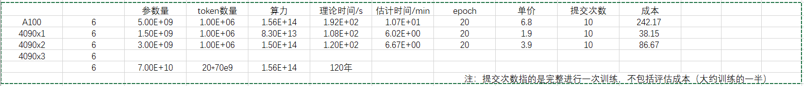

# 比赛相关的 先验思考

## 如何提升模型的性能
```text
    数据端：
        1.数据的质量要比数量重要
        2.数据的格式
            比如微调过程中是否加入tokens(微调的一个重要特性就是加入新的token)也就是指令跟随
    模型架构端：
        这个基本是确定的，但是用哪个这是非常重要的。
        如果采用 单卡A100 类型的，大概是5.0B的， 成本：
        如果采用 单卡4090 类型的，大概是1.5B的， 成本：
        如果采用 双卡4090 类型的，大概是3.0B的， 成本：
        训练总算力（Flops）= 6 * 模型的参数量 * 训练数据的 token 数
        
        vlm

        如何减少现存开销：
           Lora，混合精度，梯度检查，低精度的优化器 （最重要的应该是 Lora）
    模型优化端：
        超参数的选取

    评估端：
        采用的是10000个未标记标签的数据，估计和训练的是一样的

    推理端：
        是否可以采用上下文学习，cot之类的（限制输出在100字 以内了）


```



```text
本次比赛能做的，实际上就是输入端的prompt（涉及如何提示，比如上下文学习，Cot等）
            输出端的损失函数，正则化等
            优化过程，怎么进行优化
            

目的,快速测试代码以及实现快速实现提交一个实验结果
    训练相关：
            输入：
                如何进行预处理，就按照哪个jinja就行了，考虑是否加入一些任务相关的向量（可能有点难，就像是毕设中的深度嵌入）
                就简单的使用最初的原始输入输出就行了

                vl 中模型的输入如何确定，QwenVLModel,查看这些模型的接口

                实际上就是有一个图片处理的步骤。具体流程需要查看代码 
            
            输出：
                损失函数就采用简单的交叉熵吧，
                其他损失之后再讲

            损失：

            
    测试相关：
            需要计算哪些参数，然后进行评估，如何提交等。需要考虑并行化的测试，10000条数据需要很长的时间
            并且模型的尺寸可能很大，无法进行单机测试

```


